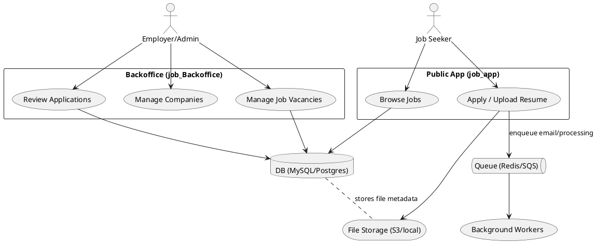

Architecture — high-level overview

This page contains a compact architecture description and a PlantUML diagram to show boundaries and data flow.

Conceptual boundaries

- Public site (`job_app`) — user registration, job browsing, applying, resume upload.
- Backoffice (`job_Backoffice`) — admin interface for companies, job postings, and reviewing applications.
- Shared services — relational database (MySQL/Postgres), queues (Redis/SQS), mail providers (SMTP/Postmark/Resend), file storage (local/S3).

Simple PlantUML diagram (render with PlantUML or https://plantuml.com/):

Notes

- Use the diagram to show where background workers and external services (mail, storage) sit.
- I can render PNG/SVG outputs from these PlantUML files on request.
